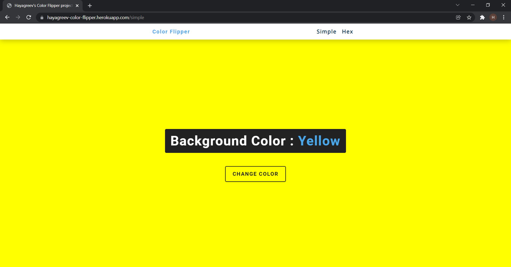
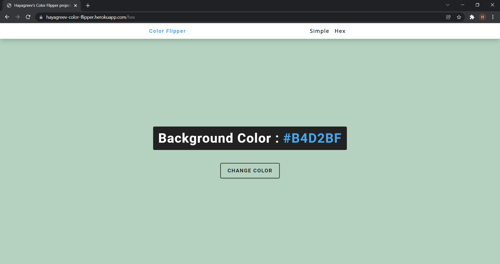

# Color Flipper

This is a basic Vanilla JS project where the background color of the body element is changed when a button is clicked. There are two pages in this project, simple and hex.

Simple page randomly generates a color from green, red, blue and yellow and assigns it to the body of the page.

Hex page randomly generates a hexadecimal code for a color on the fly and assigns it to the body of the page.

You can find the working version of this page at https://hayagreev-color-flipper.netlify.app/

I have followed John Smilga's Vannila JS projects tutorial on YouTube and built this page. I have not designed the CSS. I have only built the JavaScript functionality(app.js for simple and hex.js for hex) to gain a better understanding and grasp on my JS skills.

Link to the tutorial: https://www.youtube.com/watch?v=c5SIG7Ie0dM&t=2110s

The server side of this application is handled by Node.js and Express. I have built the server code from scratch.
# Simple page

# HEX Page

app.js, hex.js and server.js are Open Source. Feel free to use this code as a reference for your projects but please give me credits, coz, let's agree, leaching sucks!

Feel free to leave your comments at hayagreev.varadarajan@outlook.com!